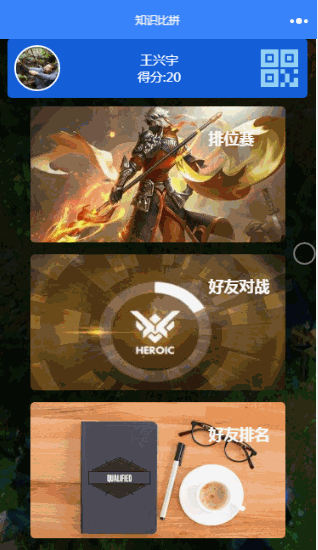
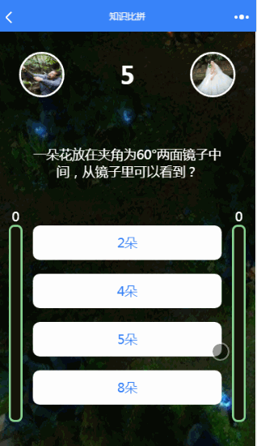
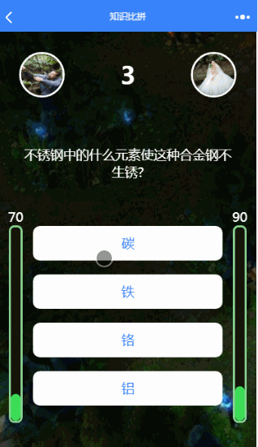
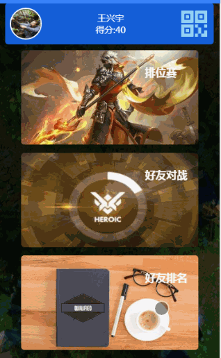

# wechat-weapp-Game-TNFB
一款基于wafer2方案的实时在线答题微信小程序游戏

##技术栈：
* 前端：微信小程序
* 后端：koa+knex

## 软件截图：
    
  

## 项目特点：
* 包含前后端整套代码
* 采用wafer2-node解决方案，前端一个人即可完成整个项目
* 采用websocket，实现实时通信


## 目录结构说明：
```
├─client # 小程序端代码
│   ├─imgs # 图片存放处
│   ├─pages # 各个页面代码的存放处
│   │─utils # 工具包
│   ├─app.js # 全局JS
│   ├─app.json # 全局配置
│   ├─app.wxss # 全局样式
├─server # 服务器端代码
└─project.config.json # 项目配置      

```


## 使用步骤：
```
1、克隆项目到本地：git clone git@github.com:wechat-wxapp/wechat-weapp-Game-TNFB.git 
2、开通腾讯云
3、修改client/config.js,修改请求地址为腾讯云解决方案分配的域名。修改appId为你的appId。
4、修改server/config.js,修改appId、appSecret为你自己的，默认的数据库密码为appId。
5、真机上测试注意打开调试默认，绕过域名检测。

```

### 项目用于学习交流, 转载请注明出处


